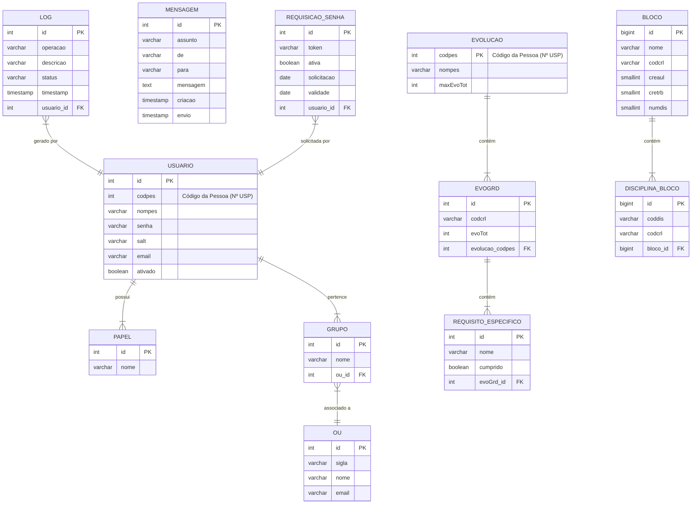

### **Modelo de Dados - Banco Local (`europa`)**

#### Diagrama Entidade-Relacionamento (DER)

O diagrama abaixo representa a estrutura do banco de dados local `europa`, mostrando as principais tabelas e seus relacionamentos.

#### Dicionário de Dados

A seguir, estão detalhadas as tabelas e colunas do banco de dados `europa`.

**Tabela: `USUARIO`**
Armazena as informações dos usuários do sistema, incluindo credenciais de acesso local e seus relacionamentos com papéis e grupos.

| Coluna | Tipo | Chave | Comentário |
| :--- | :--- | :--- | :--- |
| `id` | INT | PK | Identificador único do usuário. |
| `codpes` | INT | UK | Código da Pessoa (Número USP). |
| `nompes` | VARCHAR | | Nome completo do usuário. |
| `senha` | VARCHAR | | Hash da senha do usuário para login local. |
| `salt` | VARCHAR | | Salt utilizado para gerar o hash da senha. |
| `email` | VARCHAR | | Endereço de e-mail do usuário. |
| `ativado` | BOOLEAN | | Status de ativação da conta. |

**Tabela: `PAPEL`**
Define os papéis (perfis de acesso) que podem ser atribuídos aos usuários (ex: ADM, OPR).

| Coluna | Tipo | Chave | Comentário |
| :--- | :--- | :--- | :--- |
| `id` | INT | PK | Identificador único do papel. |
| `nome` | VARCHAR | UK | Nome do papel (ex: "ADM", "OPR"). |

**Tabela: `GRUPO`**
Define grupos de usuários, geralmente associados a uma Unidade Organizacional (OU).

| Coluna | Tipo | Chave | Comentário |
| :--- | :--- | :--- | :--- |
| `id` | INT | PK | Identificador único do grupo. |
| `nome` | VARCHAR | | Nome do grupo. |
| `ou_id` | INT | FK | Chave estrangeira para a tabela `OU`. |

**Tabela: `OU` (Unidade Organizacional)**
Cadastro de unidades, seções ou comissões às quais os grupos podem estar associados.

| Coluna | Tipo | Chave | Comentário |
| :--- | :--- | :--- | :--- |
| `id` | INT | PK | Identificador único da OU. |
| `sigla` | VARCHAR | | Sigla da unidade organizacional. |
| `nome` | VARCHAR | | Nome da unidade organizacional. |
| `email` | VARCHAR | | E-mail de contato da OU. |

**Tabela: `LOG`**
Registra as operações realizadas pelos usuários no sistema para fins de auditoria.

| Coluna | Tipo | Chave | Comentário |
| :--- | :--- | :--- | :--- |
| `id` | INT | PK | Identificador único do registro de log. |
| `operacao`| VARCHAR | | Tipo de operação realizada (ex: "LOGIN", "UPDATE"). |
| `descricao`| VARCHAR | | Detalhes da operação. |
| `status` | VARCHAR | | Resultado da operação (ex: "OK", "FALHA"). |
| `timestamp`| TIMESTAMP | | Data e hora em que a operação ocorreu. |
| `usuario_id`| INT | FK | Chave estrangeira para a tabela `USUARIO`. |

**Tabela: `MENSAGEM`**
Fila de mensagens de e-mail a serem enviadas pelo sistema de forma assíncrona.

| Coluna | Tipo | Chave | Comentário |
| :--- | :--- | :--- | :--- |
| `id` | INT | PK | Identificador único da mensagem. |
| `assunto` | VARCHAR | | Assunto do e-mail. |
| `de` | VARCHAR | | Remetente do e-mail. |
| `para` | VARCHAR | | Destinatário do e-mail. |
| `mensagem` | TEXT | | Corpo do e-mail (HTML). |
| `criacao` | TIMESTAMP | | Data e hora de criação da mensagem. |
| `envio` | TIMESTAMP | | Data e hora do envio (nulo se ainda não enviado). |

**Tabela: `REQUISICAO_SENHA`**
Armazena tokens e validades para o processo de recuperação de senha de usuários locais.

| Coluna | Tipo | Chave | Comentário |
| :--- | :--- | :--- | :--- |
| `id` | INT | PK | Identificador único da requisição. |
| `token` | VARCHAR | UK | Token único para recuperação de senha. |
| `ativa` | BOOLEAN | | Indica se a requisição ainda está ativa. |
| `solicitacao` | DATE | | Data em que a recuperação foi solicitada. |
| `validade` | DATE | | Data de expiração do token. |
| `usuario_id` | INT | FK | Chave estrangeira para a tabela `USUARIO`. |

**Tabela: `BLOCO`**
Define blocos de disciplinas eletivas para determinados currículos, com suas regras (mínimo de créditos, etc.).

| Coluna | Tipo | Chave | Comentário |
| :--- | :--- | :--- | :--- |
| `id` | BIGINT | PK | Identificador único do bloco. |
| `nome` | VARCHAR | | Nome do bloco (ex: "Psicologia da Educação"). |
| `codcrl` | VARCHAR | | Código do currículo ao qual o bloco se aplica. |
| `creaul` | SMALLINT | | Mínimo de créditos-aula exigidos no bloco. |
| `cretrb` | SMALLINT | | Mínimo de créditos-trabalho exigidos no bloco. |
| `numdis` | SMALLINT | | Mínimo de disciplinas a serem cursadas no bloco. |

**Tabela: `DISCIPLINA_BLOCO`**
Tabela de associação que lista quais disciplinas pertencem a um determinado `BLOCO`.

| Coluna | Tipo | Chave | Comentário |
| :--- | :--- | :--- | :--- |
| `id` | BIGINT | PK | Identificador único da associação. |
| `coddis` | VARCHAR | | Código da disciplina. |
| `verdis` | SMALLINT | | Versão da disciplina. |
| `codcrl` | VARCHAR | | Código do currículo (redundante, presente em `BLOCO`). |
| `bloco_id` | BIGINT | FK | Chave estrangeira para a tabela `BLOCO`. |

**Tabelas de Evolução (`EVOLUCAO`, `EVOGRD`, `REQUISITO_ESPECIFICO`)**
Estas tabelas parecem armazenar um cache ou um resumo processado da evolução dos alunos nos cursos, para otimizar consultas e relatórios.

### **Tabelas do Banco de Dados Replicado (`Replicado`)**

O sistema "Europa" consulta diversas tabelas e visões do banco de dados corporativo `Replicado` para obter informações acadêmicas e de pessoas. As principais são:

| Tabela/Visão | Comentário |
| :--- | :--- |
| **`PESSOA`** | Cadastro central com dados básicos de todas as pessoas que possuem ou já possuíram vínculo com a universidade. |
| **`VINCULOPESSOAUSP`** | Contém a consolidação dos dados de todos os vínculos de uma pessoa com a USP (graduação, pós, servidor, etc.). |
| **`HISTESCOLARGR`** | Histórico escolar do aluno de graduação, contendo todas as matrículas em disciplinas, com notas, frequência e resultados. |
| **`CURSOGR`** | Cadastro dos cursos de Graduação da USP. |
| **`HABILITACAOGR`** | Define as habilitações, opções e ênfases para os cursos de graduação. |
| **`CURRICULOGR`** | Contém os currículos das habilitações dos cursos de graduação, com suas regras de vigência e carga horária. |
| **`GRADECURRICULAR`** | Estrutura curricular que define o conjunto de disciplinas (obrigatórias, eletivas, etc.) de um currículo. |
| **`DISCIPLINAGR`** | Catálogo com os dados de todas as versões de disciplinas de graduação da USP. |
| **`PROGRAMAGR`** | Identifica os programas dos alunos de graduação e informações gerais sobre cada um (tipo de ingresso, situação, etc.). |
| **`REQUISITOGR`** | Define os pré-requisitos e co-requisitos entre as disciplinas para um determinado curso e habilitação. |
| **`EQUIVALENCIAGR`** | Tabela que define as regras de equivalência entre disciplinas. |
| **`TURMAGR`** | Identificação das turmas oferecidas para as disciplinas em um determinado semestre. |
| **`OCUPTURMA`** | Define os horários e locais (salas) de cada turma. |
| **`MINISTRANTE`** | Associa os docentes responsáveis por ministrar as aulas de cada turma e horário. |