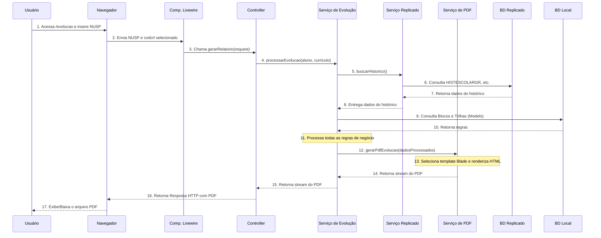

# Proposta de Arquitetura e Mapeamento de Lógica - Novo Sistema Europa

## 1. Objetivo

Este documento delineia a arquitetura de software para o novo sistema Europa, construído sobre o Laravel 12. O foco é migrar a lógica de negócio do sistema legado para uma estrutura moderna, manutenível e testável, seguindo os princípios de *Controllers Magros* e a centralização da lógica em *Services*.

## 2. Princípios Arquiteturais

A arquitetura seguirá três princípios fundamentais para garantir a qualidade e a longevidade do código:

1.  **Controllers e Componentes Livewire Magros:** A camada de apresentação (Controllers e Componentes Livewire) será responsável exclusivamente por receber requisições HTTP, validar a entrada (através de Form Requests) e orquestrar as chamadas para a camada de serviço. Ela não conterá lógica de negócio.
2.  **Lógica de Negócio em Services:** Toda a lógica de negócio complexa, como o processamento da evolução do aluno e a geração de documentos, será encapsulada em classes de serviço dedicadas (`Services`). Isso promove a reutilização, facilita os testes unitários e desacopla a lógica do framework.
3.  **Princípio da Responsabilidade Única (SRP):** Cada classe terá uma única e bem definida responsabilidade. Por exemplo, um serviço para interagir com o Replicado, outro para processar a evolução e um terceiro para gerar PDFs.

## 3. Componentes da Arquitetura

### 3.1. Camada de Apresentação e Interação

#### Controllers e Componentes Livewire
Serão os pontos de entrada para as interações do usuário. Suas responsabilidades são:
- Receber a requisição HTTP.
- Utilizar `Form Requests` para validar os dados de entrada (ex: Número USP, código do currículo).
- Chamar os `Services` apropriados, passando os dados validados.
- Retornar a resposta adequada, seja renderizando uma `View`, redirecionando o usuário ou retornando um arquivo para download (como o PDF gerado).

**Exemplo:**
- `EvolucaoController.php`: Terá um método `gerarRelatorio(GerarEvolucaoRequest $request)` que chamará o `EvolucaoService` e o `PdfGenerationService`.
- `AtestadoController.php`: Similar ao anterior, mas para gerar atestados.

### 3.2. Camada de Lógica de Negócio (Services)

Esta camada conterá o "coração" do sistema, com a lógica extraída do sistema legado.

#### `ReplicadoService`
- **Responsabilidade:** Centralizar todas as interações com o banco de dados **Replicado** através do pacote `uspdev/replicado`.
- **Funcionalidades:**
    - `buscarAluno(int $codpes)`: Retorna os dados cadastrais e de vínculo do aluno.
    - `buscarHistorico(int $codpes, int $codpgm)`: Retorna o histórico escolar completo de um aluno em um programa.
    - `buscarGradeCurricular(string $codcrl)`: Retorna a estrutura completa de uma grade curricular, incluindo suas disciplinas.
    - `buscarEquivalencias(string $coddis, string $codcrl)`: Retorna as regras de equivalência para uma disciplina em um currículo.
- **Benefício:** Cria uma camada de abstração que isola o resto da aplicação dos detalhes de implementação do `uspdev/replicado`, facilitando testes e futuras manutenções.

#### `EvolucaoService`
- **Responsabilidade:** Orquestrar todo o processo de análise da evolução acadêmica de um aluno.
- **Funcionalidades:**
    - `processarEvolucao(User $aluno, Curriculogr $curriculo)`: Método principal que recebe o modelo do aluno e do currículo.
        1.  Utiliza o `ReplicadoService` para buscar o histórico e a grade curricular completa.
        2.  Aplica as regras de negócio para **classificar cada disciplina** do histórico (Obrigatória, Eletiva, Livre, Extra-curricular).
        3.  Processa as regras de **equivalência** para promover disciplinas extra-curriculares.
        4.  Consulta os `Models` locais `Bloco` e `Trilha` para validar os **requisitos específicos** do currículo, se aplicável.
        5.  Calcula os totais de créditos (aula e trabalho) obtidos e exigidos, e os percentuais de conclusão.
        6.  Calcula o "semestre para estágio" conforme as regras de negócio.
        7.  Retorna um objeto de dados estruturado (DTO - Data Transfer Object) ou um array contendo todas as informações processadas, pronto para ser utilizado pelo `PdfGenerationService`.

#### `PdfGenerationService`
- **Responsabilidade:** Gerar os documentos em formato PDF.
- **Funcionalidades:**
    - `gerarPdfEvolucao(array $dadosEvolucao)`:
        1.  Recebe o objeto de dados estruturado do `EvolucaoService`.
        2.  Seleciona o **template Blade** apropriado com base no código do curso (`codcur`) presente nos dados (ex: `pdf.evolucao-45052`, `pdf.evolucao-map`, `pdf.evolucao-padrao`).
        3.  Renderiza a view Blade com os dados, gerando o HTML do relatório.
        4.  Utiliza uma biblioteca como `spatie/laravel-browsershot` ou `barryvdh/laravel-dompdf` para converter o HTML em um arquivo PDF.
        5.  Retorna a resposta HTTP com o PDF para download.

### 3.3. Camada de Dados (Models)

- **Models do Replicado:** Não haverá models Eloquent para o Replicado. O acesso será sempre mediado pelo `ReplicadoService`.
- **Models Locais:**
    - `User`, `Role`, `Permission`: Herdadas do Starter Kit e do `spatie/laravel-permission`.
    - `Bloco`, `DisciplinaBloco`, `Trilha`, `TrilhaRegra`, `TrilhaDisciplina`: Novos models Eloquent que representarão as regras de negócio no banco de dados local.

### 3.4. Painel Administrativo

#### Filament
- A interface para **administração** do sistema, incluindo o CRUD (Create, Read, Update, Delete) para `Blocos`, `Trilhas`, `Usuários`, `Papéis` e `Permissões`, será implementada utilizando o **Filament**. Isso garante um desenvolvimento rápido, uma interface moderna e segura para a gestão das regras de negócio.

## 4. Fluxo de Dados: Exemplo da Geração do Relatório de Evolução

O diagrama abaixo ilustra a interação entre os componentes para a principal funcionalidade do sistema.

## 5. Conclusão

Esta arquitetura baseada em `Services` e `Controllers Magros` garante uma clara separação de responsabilidades, alinhando-se com as melhores práticas do Laravel. Migrar a lógica de negócio para o banco de dados local, gerenciado pelo Filament, tornará o sistema significativamente mais flexível e fácil de manter a longo prazo.